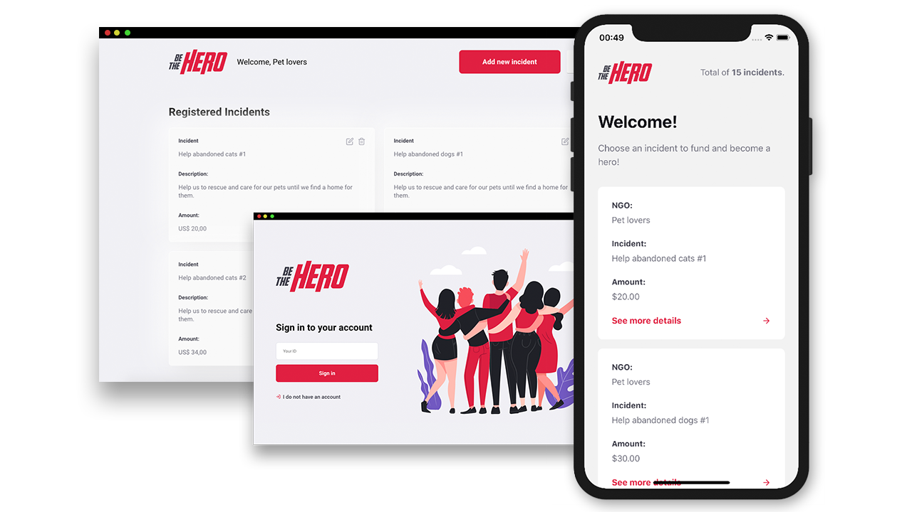

 
  

  &#xa0;

  <!-- <a href="https://bethehero.netlify.app">Demo</a> -->

<h1 align="center">Be The Hero</h1>

  

  

  
<!-- 
   -->

  <!--  -->

  <!--  -->

  <!--  -->

<!-- Status -->

<!-- <h4 align="center"> 
	🚧  Be The Hero 🚀 Under construction...  🚧
</h4> 

 -->

  <a href="#dart-about">About</a> &#xa0; | &#xa0; 
  <a href="#sparkles-features">Features</a> &#xa0; | &#xa0;
  <a href="#rocket-technologies">Technologies</a> &#xa0; | &#xa0;
  <a href="https://github.com/fernando-ff" target="_blank">Author</a>

 

## :dart: About ##

A platform to find heroes that desire help people with  any problem.

## :sparkles: Features ##

:heavy_check_mark: Login;\
:heavy_check_mark: Register a user;\
:heavy_check_mark: Register a case;\
:heavy_check_mark: Find Cases;

## :white_check_mark: Project Image ##

  

## :rocket: Technologies ##

The following tools were used in this project:

- [Expo](https://expo.io/)
- [Node.js](https://nodejs.org/en/)
- [React](https://pt-br.reactjs.org/)
- [React Native](https://reactnative.dev/)

Made with :heart: by <a href="https://github.com/fernando-ff" target="_blank">Fernando Ferreira</a>

&#xa0;

<a href="#top">Back to top</a>
